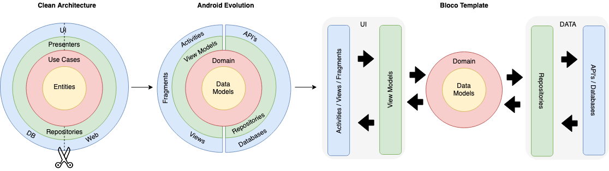

# Mercado Libre Test

## Clean architecture with 3 layers
- Data (for database, API and preferences code)
- Domain (for business logic and models)
- Presentation (for UI logic, with MVVM)

 
 
 ## Tests
- Unit tests
    
## Other useful features
- Dependency injection (with [Dagger](https://dagger.dev/dev-guide/android.html))
- Call api async (with [Kotlin Coroutines](https://developer.android.com/kotlin/coroutines?hl=es))
- Logging (with [Timber](https://github.com/JakeWharton/timber))
- Android architecture components to share ViewModels during configuration changes
- Persist data error(with [Room](https://developer.android.com/training/data-storage/room))
- Navigate between screen (with [navigation component](https://developer.android.com/guide/navigation/navigation-getting-started))
- Call api (with [Retrofit](https://square.github.io/retrofit/))
- Show data list (with [Groupie](https://github.com/lisawray/groupie))
- Loading animation (with [lottie](https://airbnb.design/lottie/))
- Load image (with [Glide](https://github.com/bumptech/glide))
